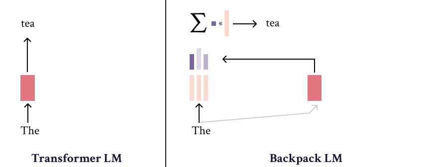
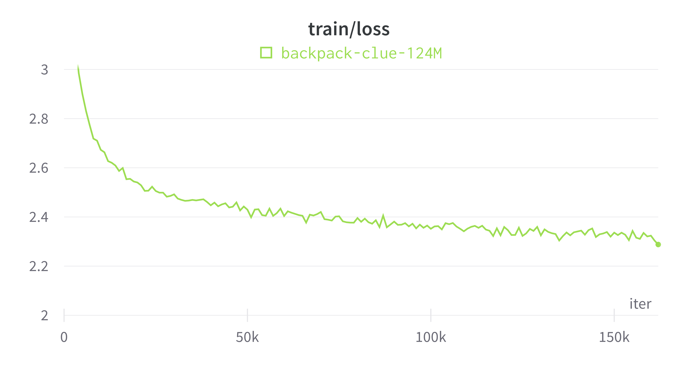

# nano-BackpackLM



This repo is the implementation of the Backpack Language Model used in Stanford CS224N Winter 2023 Best Custom Project [Nano Backpack Language Model on Chinese Characters](http://web.stanford.edu/class/cs224n/project.html). The Backpack LM structure is based on the paper [Backpack Language Models](https://arxiv.org/abs/2305.16765). Here is the Official Github Repo of [Backpack LM](https://github.com/john-hewitt/backpacks-flash-attn).

It is a simple repository for training/finetuning medium-sized Backpacks inspired by and based on [nanoGPT](https://github.com/karpathy/nanoGPT).

The model is implemented very easy and simple, so feel free to hack to your needs. You can train new models from scratch, or finetune pretrained checkpoints.

I would like to appreciate the author of Backpack LM and the head TA of CS224N 2023, [John Hewitt](https://nlp.stanford.edu/~johnhew/), for his great help and support on this project. I would also like to appreciate the author of nanoGPT, [Andrej Karpathy](https://karpathy.ai/), for his great codebase.

## install

Dependencies:

- [pytorch](https://pytorch.org) <3
- [numpy](https://numpy.org/install/) <3
- `pip install transformers` for huggingface transformers <3 (to load GPT-2 checkpoints for comparison. You don't need it if you only train Backpack models)
- `pip install datasets` for huggingface datasets <3 (if you want to download + preprocess OpenWebText)
- `pip install tiktoken` for OpenAI's fast BPE code <3
- `pip install wandb` for optional logging <3
- `pip install tqdm`

## quick start

**Note: Everything is similar to the instruction of nanoGPT so I just copied most of the instructions 😂.**

If you are not a deep learning professional and you just want to feel the magic and get your feet wet, the fastest way to get started is to train a character-level BackpackLM on the works of Shakespeare. First, we download it as a single (1MB) file and turn it from raw text into one large stream of integers:

```
$ python data/shakespeare_char/prepare.py
```

This creates a `train.bin` and `val.bin` in that data directory. Now it is time to train your BackpackLM. The size of it very much depends on the computational resources of your system:

**I have a GPU**. Great, we can quickly train a baby BackpackLM with the settings provided in the [config/train_shakespeare_char.py](config/train_shakespeare_char.py) config file:

```
$ python train.py config/train_shakespeare_char.py
```

If you peak inside it, you'll see that we're training a BackpackLM with a context size of up to 256 characters, 384 feature channels, and it is a 6-layer Transformer with 6 heads in each layer. On one A100 GPU this training run takes about 3 minutes and the best validation loss is 1.4697. Based on the configuration, the model checkpoints are being written into the `--out_dir` directory `out-shakespeare-char`. So once the training finishes we can sample from the best model by pointing the sampling script at this directory:

```
$ python sample.py --out_dir=out-shakespeare-char
```

This generates a few samples, for example:

```
ANGELO:
And cowards it be strawn to my bed,
And thrust the gates of my threats,
Because he that ale away, and hang'd
An one with him.

DUKE VINCENTIO:
I thank your eyes against it.

DUKE VINCENTIO:
Then will answer him to save the malm:
And what have you tyrannous shall do this?

DUKE VINCENTIO:
If you have done evils of all disposition
To end his power, the day of thrust for a common men
That I leave, to fight with over-liking
Hasting in a roseman.
```

lol  `¯\_(ツ)_/¯`. Not bad for a character-level model after 3 minutes of training on a GPU. Better results are quite likely obtainable by instead finetuning a pretrained BackpackLM model on this dataset (see finetuning section later).

**I only have a macbook** (or other cheap computer). No worries, we can still train a BackpackLM but we want to dial things down a notch. I recommend getting the bleeding edge PyTorch nightly ([select it here](https://pytorch.org/get-started/locally/) when installing) as it is currently quite likely to make your code more efficient. But even without it, a simple train run could look as follows:

```
$ python train.py config/train_shakespeare_char.py --device=cpu --compile=False --eval_iters=20 --log_interval=1 --block_size=64 --batch_size=12 --n_layer=4 --n_head=4 --n_embd=128 --max_iters=2000 --lr_decay_iters=2000 --dropout=0.0
```

Here, since we are running on CPU instead of GPU we must set both `--device=cpu` and also turn off PyTorch 2.0 compile with `--compile=False`. Then when we evaluate we get a bit more noisy but faster estimate (`--eval_iters=20`, down from 200), our context size is only 64 characters instead of 256, and the batch size only 12 examples per iteration, not 64. We'll also use a much smaller Transformer (4 layers, 4 heads, 128 embedding size), and decrease the number of iterations to 2000 (and correspondingly usually decay the learning rate to around max_iters with `--lr_decay_iters`). Because our network is so small we also ease down on regularization (`--dropout=0.0`). This still runs in about ~3 minutes, but gets us a loss of only 1.88 and therefore also worse samples, but it's still good fun:

```
GLEORKEN VINGHARD III:
Whell's the couse, the came light gacks,
And the for mought you in Aut fries the not high shee
bot thou the sought bechive in that to doth groan you,
No relving thee post mose the wear
```

Not bad for ~3 minutes on a CPU, for a hint of the right character gestalt. If you're willing to wait longer free to tune the hyperparameters, increase the size of the network, the context length (`--block_size`), the length of training, etc.

Finally, on Apple Silicon Macbooks and with a recent PyTorch version make sure to add `--device mps` (short for "Metal Performance Shaders"); PyTorch then uses the on-chip GPU that can *significantly* accelerate training (2-3X) and allow you to use larger networks. See nanoGPT [Issue 28](https://github.com/karpathy/nanoGPT/issues/28) for more.

### senses

Let's check the easiest example above. You can use the helper functions in `experiments/sense_vector.py` to help you with analysing the senses.

For example, with the minimum shakespeare model, you can run

```
$ python experiments/sense_vector.py --device=cpu --compile=False --out_dir=out-shakespeare-char
```

In this example, it calls `sense_projection` function to predict the next most possible words based on each senses of the given words. The output is like

```
# a
[['t', 'l', 'r', 'n', ' '], ['y', 'k', 'n', 'r', 't'], ['e', 't', 'm', 'o', 'a'], ['d', 'r', 'v', ' ', '\n']]
# e
[['e', 'a', 'v', 'x', 'n'], ['n', 'd', 'r', ' ', 's'], ['\n', 's', 'v', 't', '.'], ['.', ':', ',', 'r', ' ']]
# c
[[' ', ',', 'k', '\n', '.'], ['h', 'e', 'k', 'o', 'a'], ['n', 'm', 'e', 'i', 's'], ['l', 'u', 'm', 'a', 'o']]
# s
[[' ', ',', '\n', 'e', ';'], ['h', 't', 's', 'e', 'w'], ['y', '.', '\n', ':', ','], ['p', 'l', 'e', 'c', 'r']]
# t
[['e', 'h', 'o', 'r', ' '], ['h', 'w', 'H', 'a', 'I'], [' ', '\n', '-', ':', '.'], ['h', 'o', 't', 'u', 's']]
```

Although this model is very very micro and only has four senses, let's have a look! 
Letter "a" tends to predict "d" to make "...ad..." on Sense 3, while "e" tends to end the sentence with ".". For "c", "s", "t", very common patterns "cl...", "sp...", "th..." are most predicted.

If you have 16, 64, or even more senses, you will find each sense represents or tends to predict some specific patterns / meanings of the word!


## train BackpackLM

A more serious deep learning professional may be more interested in pretraining BackpackLM. So here we go - we first tokenize the dataset, in this case the [OpenWebText](https://openwebtext2.readthedocs.io/en/latest/), an open reproduction of OpenAI's (private) WebText:

```
$ python data/openwebtext/prepare.py
```

This downloads and tokenizes the [OpenWebText](https://huggingface.co/datasets/openwebtext) dataset. It will create a `train.bin` and `val.bin` which holds the GPT2 BPE token ids in one sequence, stored as raw uint16 bytes. Then we're ready to kick off training. To reproduce BackpackLM-small (~124M) you'll want at least an 8X A100 40GB node and run:

```
$ torchrun --standalone --nproc_per_node=8 train.py config/train_backpack_lm.py
```

This will run for about 4 days using PyTorch Distributed Data Parallel (DDP).

If you're in a cluster environment and you are blessed with multiple GPU nodes you can make GPU go brrrr e.g. across 2 nodes like:

```
Run on the first (master) node with example IP 123.456.123.456:
$ torchrun --nproc_per_node=8 --nnodes=2 --node_rank=0 --master_addr=123.456.123.456 --master_port=1234 train.py
Run on the worker node:
$ torchrun --nproc_per_node=8 --nnodes=2 --node_rank=1 --master_addr=123.456.123.456 --master_port=1234 train.py
```

It is a good idea to benchmark your interconnect (e.g. iperf3). In particular, if you don't have Infiniband then also prepend `NCCL_IB_DISABLE=1` to the above launches. Your multinode training will work, but most likely _crawl_. By default checkpoints are periodically written to the `--out_dir`. We can sample from the model by simply `$ python sample.py`.

Finally, to train on a single GPU simply run the `$ python train.py` script. Have a look at all of its args, the script tries to be very readable, hackable and transparent. You'll most likely want to tune a number of those variables depending on your needs.


## Train Chinese models with CLUE / TigerBot Datasets

You can reproduce the project by using CLUE datasets like following:

* Download the CLUE datasets from [this repo](https://github.com/brightmart/nlp_chinese_corpus) and put them in `data/clue_small/` folder.

```
$ python data/clue_small/prepare.py
$ torchrun --standalone --nproc_per_node=8 train.py config/train_clue_small.py
```



Similarly, you can use TigerBot datasets by following:
```
$ python data/tigerbot/prepare.py
$ torchrun --standalone --nproc_per_node=8 train.py config/train_tigerbot.py
```


## sampling / inference

Use the script `sample.py` to sample from a model you trained yourself. For example:

```
$ python sample.py \
    --init_from=backpack-small \
    --start="What is the answer to life, the universe, and everything?" \
    --num_samples=5 --max_new_tokens=100
```
If you'd like to sample from a model you trained, use the `--out_dir` to point the code appropriately. You can also prompt the model with some text from a file, e.g. `$ python sample.py --start=FILE:prompt.txt`.

## efficiency notes
Note that the code by default uses [PyTorch 2.0](https://pytorch.org/get-started/pytorch-2.0/). At the time of writing (Dec 29, 2022) this makes `torch.compile()` available in the nightly release. The improvement from the one line of code is noticeable, e.g. cutting down iteration time from ~250ms / iter to 135ms / iter. Nice work PyTorch team!
